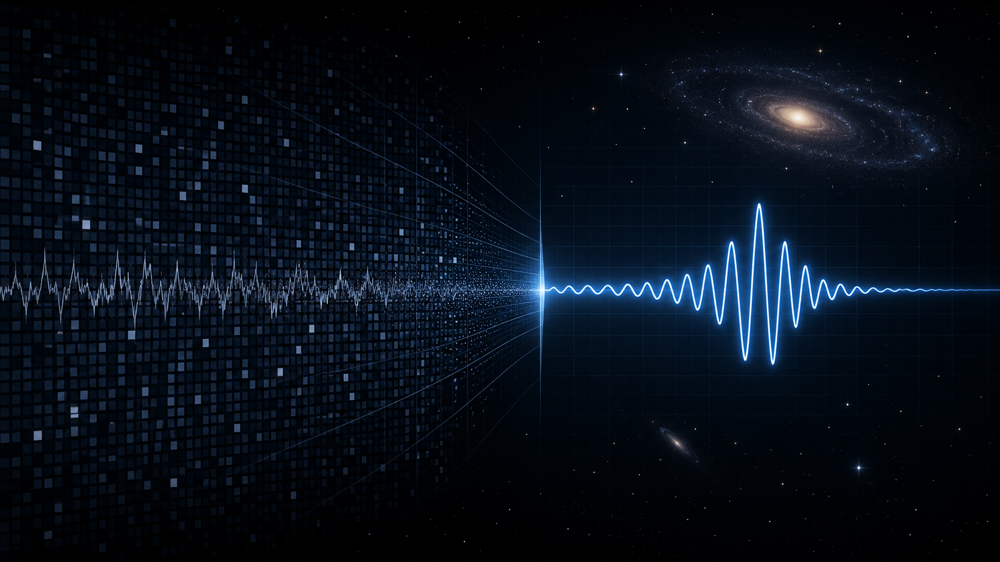
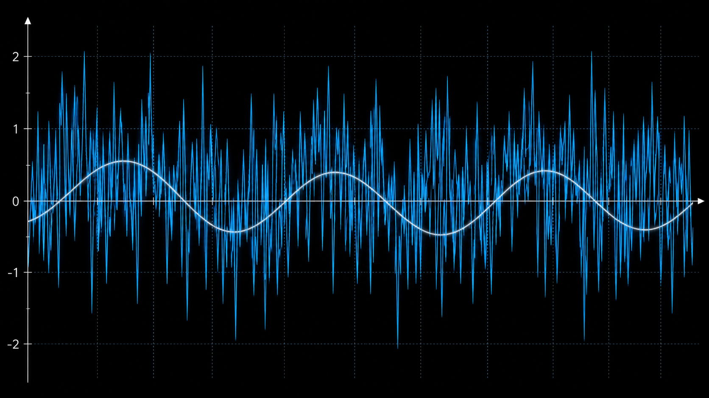
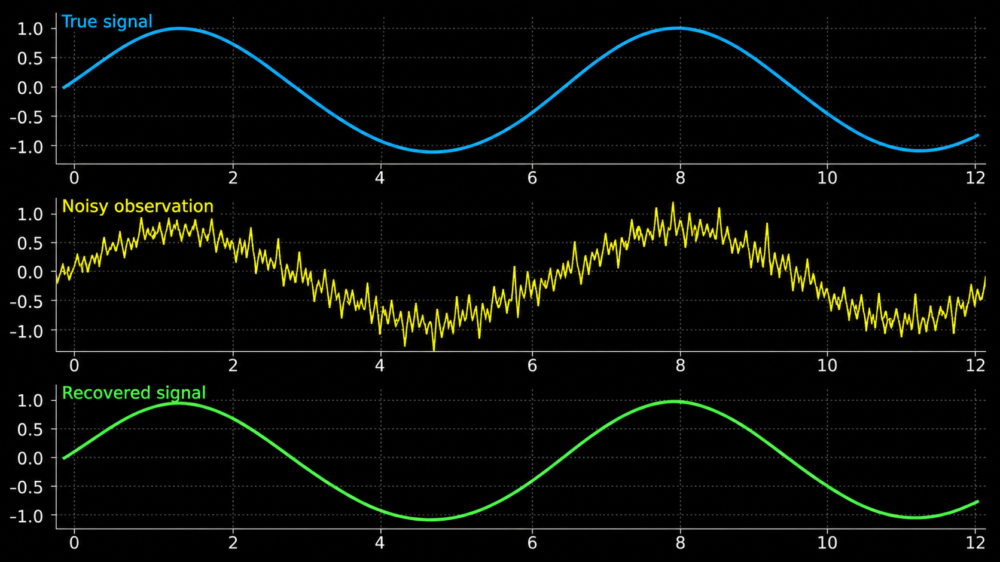
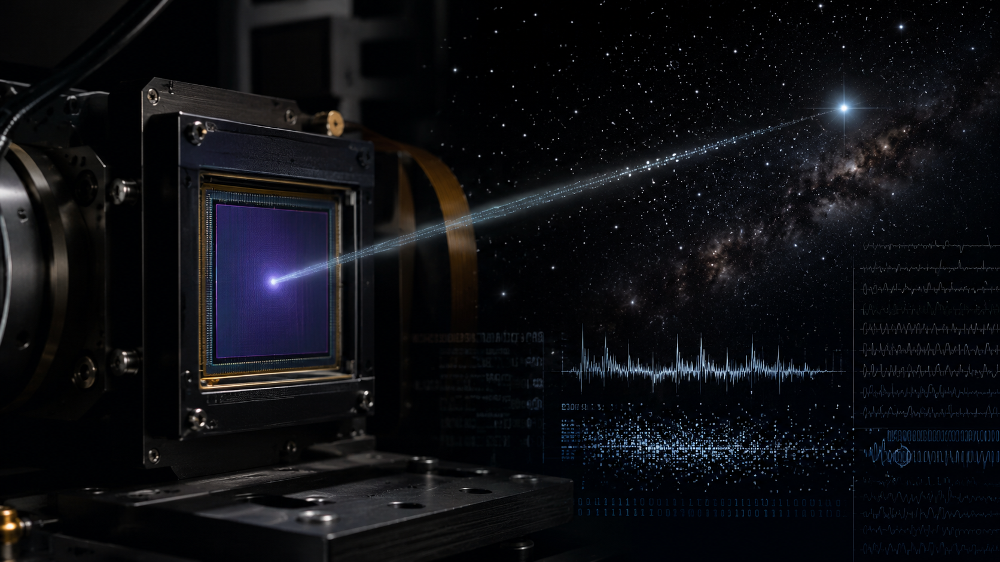

<p align="center">
  
</p>

# Noise + Signal Simulator

> Interactive scientific tool for exploring how noise affects weak signals and how smoothing can help recover hidden patterns.


---

## What this project does

This project simulates a clean scientific signal, adds random noise, and then applies smoothing to show how hidden patterns can be recovered.

Users can explore:

- true signal
- noisy observation
- smoothed recovery
- noise level
- smoothing window
- signal-to-noise ratio

---

## Why this matters

Noise is unavoidable in real scientific measurements.

In astronomy and instrumentation, weak signals are often affected by:

- detector noise
- photon noise
- sky background
- thermal effects
- electronic noise
- environmental fluctuations

Understanding signal-to-noise ratio is essential for interpreting data from telescopes, spectrographs, detectors, and laboratory instruments.

---

## Visual Understanding

### Noisy Scientific Signal

<p align="center">
  
</p>

A weak signal can be hidden beneath random fluctuations.

---

### Signal Recovery

<p align="center">
  
</p>

Smoothing can help reveal the underlying pattern, but excessive smoothing may remove real features.

---

### Detector Noise Context

<p align="center">
  
</p>

Instruments often record both real signal and unwanted noise.

---

## Physics and data-analysis background

A simplified signal-to-noise ratio can be written as:

```text
SNR = signal strength / noise strength
